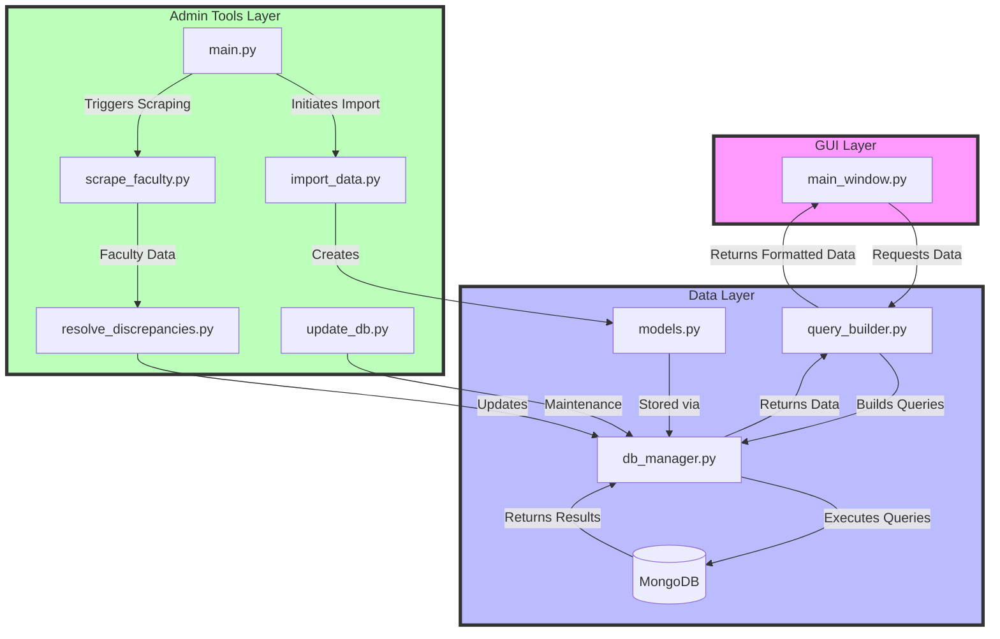
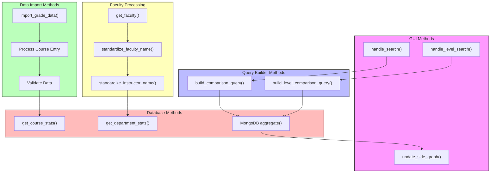

# System Architecture and Design Documentation

## System Overview

### System Architecture Flowchart



### Method Interaction Flowchart



## Software Architecture

### Component Decomposition

The EasyA Grade Analysis System is decomposed into three main layers:

1. **Data Layer**
   - `models.py`: Defines core data structures (Course, Instructor, GradeDistribution)
   - `db_manager.py`: Handles MongoDB database operations and query execution
   - `query_builder.py`: Constructs complex MongoDB aggregation pipelines

2. **Admin Tools Layer**
   - `import_data.py`: Handles data import from grade data files
   - `scrape_faculty.py`: Web scraping for faculty information
   - `resolve_discrepancies.py`: Standardizes instructor names
   - `update_db.py`: Manages database maintenance operations
   - `main.py`: Admin interface for data operations

3. **GUI Layer**
   - `main_window.py`: Implements the dual-window visualization interface

### Component Interaction

The system implements its key features through the following component interactions:

1. **Data Import and Preprocessing**
   ```
   import_data.py → models.py → db_manager.py
   scrape_faculty.py → resolve_discrepancies.py → db_manager.py
   ```
   - `import_data.py` parses grade data and creates model instances
   - `scrape_faculty.py` gathers faculty information
   - `resolve_discrepancies.py` standardizes names between sources
   - All data is stored via `db_manager.py`

2. **Grade Analysis and Visualization**
   ```
   main_window.py → query_builder.py → db_manager.py
   ```
   - User requests flow from GUI to query builder
   - Query builder constructs appropriate MongoDB pipelines
   - Database manager executes queries and returns results
   - GUI displays visualizations of the data

## Design Rationale

### Key Design Decisions

1. **Three-Layer Architecture**
   - *Rationale*: Separates concerns between data management, administrative tools, and user interface
   - *Benefit*: Allows independent development and testing of each layer

2. **MongoDB Database**
   - *Rationale*: Flexible schema supports varying course structures and grade distributions
   - *Benefit*: Efficient aggregation pipelines for complex grade analysis queries

3. **Dual-Window GUI**
   - *Rationale*: Enables side-by-side comparison of grade distributions
   - *Benefit*: Users can easily compare different courses, departments, or time periods

4. **Separate Admin Tools**
   - *Rationale*: Isolates data management from end-user functionality
   - *Benefit*: Maintains clear separation between administrative and user workflows

## Module Interface Specifications

### Data Layer

#### Models (`models.py`)

```python
class Course:
    def __init__(self, course_id: str, department: str, number: int, level: int)
    def to_dict() -> dict

class Instructor:
    def __init__(self, name: str, is_regular_faculty: bool, departments: list)
    def to_dict() -> dict

class GradeDistribution:
    def __init__(self, course_id: str, instructor_name: str, year: int,
                 term: str, percent_a: float, percent_df: float, total_students: int)
    def to_dict() -> dict
```

#### Database Manager (`db_manager.py`)

```python
class DatabaseManager:
    def __init__(self, connection_string: str = "mongodb://localhost:27017/")
    def get_course_stats(course_id: str) -> Dict[str, Any]
    def get_department_stats(department: str, level: Optional[int]) -> List[Dict[str, Any]]
    def get_instructor_stats(instructor_name: str) -> Dict[str, Any]
```

#### Query Builder (`query_builder.py`)

```python
class QueryBuilder:
    def build_comparison_query(
        department: str,
        course_number: Optional[int] = None,
        level: Optional[int] = None,
        instructors_only: bool = False,
        metric: str = "percent_a"
    ) -> List[Dict[str, Any]]
    
    def build_level_comparison_query(
        department: str,
        level: int,
        metric: str = "percent_a"
    ) -> List[Dict[str, Any]]
```

### Admin Tools Layer

#### Data Importer (`import_data.py`)

```python
class DataImporter:
    def __init__(self, db_manager: DatabaseManager)
    def import_grade_data(json_file_path: str) -> None
```

#### Faculty Scraper (`scrape_faculty.py`)

```python
class WebScraper:
    def __init__(self, base_url: str)
    def get_code(url: str, retries: int = 3, delay: int = 60) -> BeautifulSoup
    def get_departments(soup: BeautifulSoup) -> List[str]
    def get_faculty(soup: BeautifulSoup) -> List[str]
```

#### Name Standardizer (`resolve_discrepancies.py`)

```python
class NameStandardizer:
    def __init__(self, faculty_list_path: str)
    def standardize_faculty_name(faculty_name: str) -> Tuple[str, str, str]
    def standardize_instructor_name(instructor_name: str) -> Tuple[str, str, str]
    def is_regular_faculty(instructor_name: str) -> bool
```

### GUI Layer

#### Main Window (`main_window.py`)

```python
class DualWindowApp:
    def __init__(self, root: tk.Tk)
    def update_side_graph(side: str, results: List[Dict])
    def handle_search(side: str)
    def handle_level_search(side: str)
```

## Design Goals and Satisfaction

The architecture satisfies several key design goals:

1. **Data Integrity**
   - Standardized data models ensure consistency
   - Name resolution handles faculty identification
   - Robust import validation prevents corrupt data

2. **Performance**
   - MongoDB indexing optimizes query performance
   - Aggregation pipelines handle complex analyses efficiently
   - Pagination manages large result sets

3. **Maintainability**
   - Clear separation of concerns
   - Well-defined interfaces between components
   - Isolated admin tools for data management

4. **Extensibility**
   - Modular design allows new features
   - Query builder can support new analysis types
   - GUI can be expanded for additional visualizations